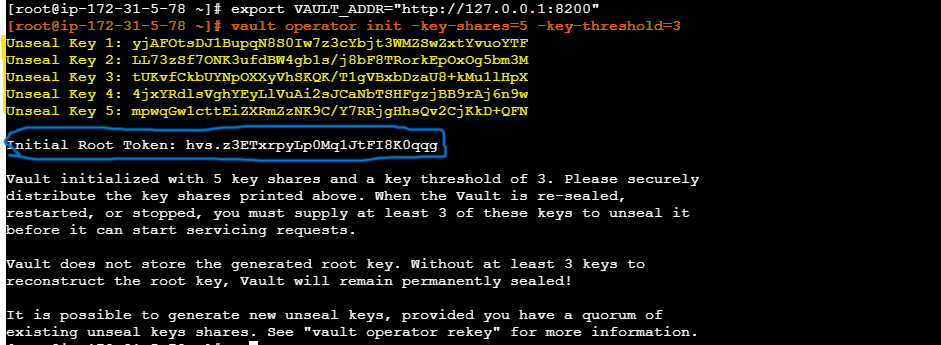

# Step-by-Step Process: Vault on EC2 + GitHub Actions + Terraform

This document explains how to deploy HashiCorp Vault on an EC2 instance and configure it to provide temporary AWS credentials to GitHub Actions for Terraform.

---

## Architecture


---

## Why Vault Instead of Direct OIDC?

| Feature | Direct OIDC | Vault |
|---------|------------|-------|
| Setup complexity | Simple | More complex |
| Secret rotation | N/A | Automatic |
| Credential scope | IAM Role level | Fine-grained per-path |
| Audit logging | CloudTrail only | Vault audit + CloudTrail |
| Multi-cloud | One provider at a time | AWS + GCP + Azure from one Vault |
| Database secrets | Not possible | Dynamic DB credentials |
| Best for | Simple setups | Enterprise, multi-team, multi-cloud |

---

## Prerequisites

- [ ] AWS Account
- [ ] GitHub Repository
- [ ] A domain name (optional, for HTTPS on Vault)
- [ ] Basic Linux/SSH knowledge

---

## Step 0: Create S3 Bucket and DynamoDB Table for Terraform State

### Create S3 Bucket:

1. Open AWS Console → Search "S3" → Click "Create bucket"
2. Bucket name: `devsecops-vault-state-2025` (must be globally unique, change if taken)
3. Region: `ap-south-1` (Mumbai) or your preferred region
4. Enable "Bucket Versioning" → Enabled
5. Enable "Default encryption" → SSE-S3 (AES-256)
6. Block all public access → ✅ Keep all checked
7. Click "Create bucket"

### Create DynamoDB Table:

1. Open AWS Console → Search "DynamoDB" → Click "Create table"
2. Table name: `vault-state-lock`
3. Partition key: `LockID` (type: String)
4. Leave everything else default
5. Click "Create table"

### ⚠️ What YOU need to change in GitHub Variables later (Step 8):

| Variable | Value |
|----------|-------|
| `VAULT_STATE_BUCKET` | The bucket name you created above |
| `VAULT_LOCK_TABLE` | The DynamoDB table name you created above |

---

## Step 1: Launch EC2 Instance for Vault

### Create IAM Role for EC2 first:

1. AWS Console → IAM → Roles → Create Role
2. Trusted entity: **AWS Service** → **EC2**
3. Attach policy: `AdministratorAccess`
4. Role name: `Vault-EC2-Role`
5. Create Role

### Launch EC2:

1. EC2 → Launch Instance
2. Name: `vault-server`
3. AMI: Amazon Linux 2023
4. Instance type: `t3.small` (minimum for Vault)
5. Key pair: Create or select existing
6. **IAM instance profile: Select `Vault-EC2-Role`** (this gives Vault access to AWS without keys)
7. Security Group:
   - SSH (22) — your IP only
   - Custom TCP (8200) — your IP + GitHub Actions IPs (for Vault API)
8. Storage: 20 GB gp3
9. Launch

### Note the public IP or Elastic IP of this instance.

> **Why IAM Role?** Vault uses the EC2 instance role to generate temporary AWS credentials. No access keys are stored anywhere — not in Vault, not in GitHub, not on disk.

---

## Step 2: Install Vault on EC2

SSH into the instance and run:

```bash
# SSH into the instance
ssh -i your-key.pem ec2-user@YOUR_EC2_PUBLIC_IP

# Install Vault
sudo yum install -y yum-utils
sudo yum-config-manager --add-repo https://rpm.releases.hashicorp.com/AmazonLinux/hashicorp.repo
sudo yum -y install vault

# Verify installation
vault --version
```

---

## Step 3: Configure Vault Server

```bash
# Create Vault config directory
sudo mkdir -p /etc/vault.d
sudo mkdir -p /opt/vault/data
```

### Create Vault config file
```bash
sudo tee /etc/vault.d/vault.hcl > /dev/null <<EOF
storage "file" {
  path = "/opt/vault/data"
}

listener "tcp" {
  address     = "0.0.0.0:8200"
  tls_disable = 1
  # For production: Enable TLS with a real certificate
  # tls_cert_file = "/etc/vault.d/tls/vault-cert.pem"
  # tls_key_file  = "/etc/vault.d/tls/vault-key.pem"
}

api_addr = "http://YOUR_EC2_PUBLIC_IP:8200"

ui = true
EOF

```
### verify the config file was written correctly are not
```bash
cat /etc/vault.d/vault.hcl
```


### Set permissions
```bash
sudo chown -R vault:vault /etc/vault.d /opt/vault
```

### ⚠️ What YOU need to change:

| Line | Change | Example |
|------|--------|---------|
| `api_addr = "http://YOUR_EC2_PUBLIC_IP:8200"` | Replace `YOUR_EC2_PUBLIC_IP` with your EC2 public IP | `api_addr = "http://3.110.45.67:8200"` |

That's the **only thing** you change in this step. Everything else stays as-is.

---

## Step 4: Start Vault as a Service

#### Create systemd service

```bash
sudo tee /etc/systemd/system/vault.service > /dev/null <<EOF
[Unit]
Description=HashiCorp Vault
After=network.target

[Service]
User=vault
Group=vault
ExecStart=/usr/bin/vault server -config=/etc/vault.d/vault.hcl
ExecReload=/bin/kill -HUP \$MAINPID
LimitNOFILE=65536

[Install]
WantedBy=multi-user.target
EOF
```
#### Start Vault

```bash
# Start Vault
sudo systemctl enable vault
sudo systemctl start vault
sudo systemctl status vault
```

---

## Step 5: Initialize and Unseal Vault

#### Set Vault address
```bash
export VAULT_ADDR="http://127.0.0.1:8200"
```
#### Initialize Vault (SAVE THESE KEYS SECURELY!)
```bash
vault operator init -key-shares=5 -key-threshold=3
```
- `key-shares=5` → generates 5 unseal keys
- `key-threshold=3` → you need any 3 of 5 to unseal

#### SAVE THESE SOMEWHERE SAFE (password manager, not in git!)


#### Unseal Vault (need 3 of 5 keys)(Run this in ec2)

```bash
vault operator unseal <KEY_1>
vault operator unseal <KEY_2>
vault operator unseal <KEY_3>
```

> Replace `<KEY_1>`, `<KEY_2>`, `<KEY_3>` with any 3 unseal keys from the output above.

#### Login with root token (run it on your EC2)
```bash
export VAULT_ADDR="http://127.0.0.1:8200"
```
```bash
vault login <ROOT_TOKEN>
```

> Replace `<ROOT_TOKEN>` with the Initial Root Token from the output above.
---

## Step 6: Enable AWS Secrets Engine

This tells Vault how to generate temporary AWS credentials.
Vault uses the EC2 instance's IAM Role (attached in Step 1) — no access keys needed.

#### Enable the AWS secrets engine
```bash
vault secrets enable aws
```
```bash
# Configure Vault to use the EC2 instance role (NO access keys!)
# Vault automatically picks up credentials from the IAM Role attached to the EC2
# Replace YOUR_REGION with your actual AWS region (e.g., ap-south-1)
vault write aws/config/root \
  region=YOUR_REGION
```
```bash
# Create a role that Terraform will use
# This role generates STS credentials with AdministratorAccess
vault write aws/roles/terraform-role \
  credential_type=iam_user \
  policy_arns=arn:aws:iam::aws:policy/AdministratorAccess \
  default_ttl=1h \
  max_ttl=2h
```
```bash
# Test: Generate temporary credentials
vault read aws/creds/terraform-role
# Output:
# Key            Value
# access_key     AKIA...
# secret_key     xxxxx
# security_token xxxxx
# ttl            1h
```

> **Important:** The EC2 instance must have an IAM Role attached with `AdministratorAccess` (or permissions to create STS credentials). This is done in Step 1 when launching the EC2 instance.

---

## Step 7: Enable JWT Auth for GitHub Actions

This tells Vault to trust GitHub Actions OIDC tokens.

### Enable JWT auth method
```bash
vault auth enable jwt
```
### Configure JWT auth to trust GitHub's OIDC provider
```bash
vault write auth/jwt/config \
  bound_issuer="https://token.actions.githubusercontent.com" \
  oidc_discovery_url="https://token.actions.githubusercontent.com"
```
### Create a policy for GitHub Actions (what it can access in Vault)
```bash
vault policy write github-actions-policy - <<EOF
# Allow reading AWS credentials
path "aws/creds/terraform-role" {
  capabilities = ["read"]
}

# Allow reading AWS STS credentials
path "aws/sts/terraform-role" {
  capabilities = ["read"]
}
EOF
```
### Create a role that maps GitHub repos to Vault policies

```bash
curl --header "X-Vault-Token: <YOUR_ROOT_TOKEN>" \
  --request POST \
  --data '{
    "role_type": "jwt",
    "bound_audiences": ["sigstore"],
    "bound_claims_type": "glob",
    "bound_claims": {"repository": "<YOUR_GITHUB_USERNAME/REPO_NAME>"},
    "user_claim": "repository",
    "policies": ["github-actions-policy"],
    "ttl": "1h"
  }' \
  http://127.0.0.1:8200/v1/auth/jwt/role/github-actions-role

#IMPORTANT: Change 'arumullayaswanth/DevSecOps-Zero-to-Hero' to YOUR repo
#MPORTANT: Change the X-Vault-Token value to YOUR root token from Step 5
#Example like this : 

```

```bash
curl --header "X-Vault-Token: <YOUR_ROOT_TOKEN>" \
  --request POST \
  --data '{
    "role_type": "jwt",
    "bound_audiences": ["sigstore"],
    "bound_claims_type": "glob",
    "bound_claims": {"repository": "arumullayaswanth/DevSecOps-Zero-to-Hero"},
    "user_claim": "repository",
    "policies": ["github-actions-policy"],
    "ttl": "1h"
  }' \
  http://127.0.0.1:8200/v1/auth/jwt/role/github-actions-role

```

#### Run this to verify the role was created:

```bash
vault read auth/jwt/role/github-actions-role
```
You should see output like:

```bash
Key                        Value
---                        -----
bound_audiences            [sigstore]
bound_claims               map[repository:arumullayaswanth/DevSecOps-Zero-to-Hero]
bound_claims_type          glob
policies                   [github-actions-policy]
role_type                  jwt
ttl                        1h
user_claim                 repository
```

---

## Step 8: Add GitHub Variables

The `VAULT_ROLE` is the role name you created in Step 7. To see it:

```bash
vault list auth/jwt/role
```

Output will show:

```
Keys
----
github-actions-role
```
So your `VAULT_ROLE` = `github-actions-role`


Go to GitHub → Repo → Settings → Secrets and variables → Actions → Variables tab

Only add these **mandatory** variables (everything else has defaults in the code):

| Variable | Value | Why it's needed |
|----------|-------|-----------------|
| `VAULT_ADDR` | `http://YOUR_EC2_PUBLIC_IP:8200` | Where Vault is running |
| `VAULT_ROLE` | `github-actions-role` | Vault role for JWT auth |
| `AWS_REGION` | Your region (e.g., `ap-south-1`) | Where to create infrastructure |
| `VAULT_STATE_BUCKET` | Your S3 bucket name | Where state is stored |
| `VAULT_LOCK_TABLE` | DynamoDB table name | State locking |

**What's NOT in GitHub Variables (set directly in code):**
- `TF_WORKING_DIR` = `Episode-07-IaC-Security/terraform-vault` (in workflow yml)
- `TF_STATE_KEY` = `vault/terraform.tfstate` (in backend.tf)
- `allowed_ssh_cidr` = `0.0.0.0/0` (default in variables.tf — open for practice)
- `environment` = `production` (default in variables.tf)
- `vpc_cidr` = `10.0.0.0/16` (default in variables.tf)
- `instance_type` = `t3.micro` (default in variables.tf)
- `vault_aws_role` = `terraform-role` (default in variables.tf)

---

## Step 9: Test the Workflow

```bash
# Create a branch
git checkout -b test-vault-infra

# Push and create PR
git add .
git commit -m "Test Vault-based Terraform"
git push -u origin test-vault-infra

# Or manually trigger:
# GitHub → Actions → "Terraform with Vault" → Run workflow → Select env + action
```

---

## Step 10: Verify It Works

1. Go to GitHub Actions → Check the workflow run
2. It should:
   - Authenticate to Vault via JWT ✅
   - Get temporary AWS credentials from Vault ✅
   - Run terraform plan/apply ✅
   - Credentials expire after 1 hour ✅

---

## Security Checklist for Vault on EC2

- [ ] Use TLS (HTTPS) for Vault in production (Let's Encrypt or ACM)
- [ ] Restrict security group to only GitHub Actions IPs and your IP
- [ ] Store unseal keys in separate secure locations (not all in one place)
- [ ] Enable Vault audit logging (`vault audit enable file file_path=/var/log/vault-audit.log`)
- [ ] Use auto-unseal with AWS KMS (so Vault auto-unseals on restart)
- [ ] Set short TTLs for AWS credentials (1h max)
- [ ] Restrict the JWT role to only your specific repository
- [ ] Regular Vault backups (`vault operator raft snapshot save`)

---

## Troubleshooting

### Error: "permission denied" from Vault
- Check the policy attached to `github-actions-role`
- Verify the `bound_claims` matches your exact repo name

### Error: "Vault is sealed"
- You need to unseal Vault after every restart
- Use auto-unseal with KMS to avoid this

### Error: "no credentials found"
- Check that AWS secrets engine is enabled: `vault secrets list`
- Check the role exists: `vault read aws/roles/terraform-role`

### Error: "JWT validation failed"
- Check that `bound_audiences` matches (should be `sigstore`)
- Check that `oidc_discovery_url` is correct

---

## Comparison: OIDC vs Vault

| | OIDC (terraform-OIDC) | Vault (terraform-vault) |
|---|---|---|
| Setup time | 30 minutes | 2-3 hours |
| Infrastructure needed | None (AWS only) | EC2 instance running Vault |
| Maintenance | Zero | Vault updates, unsealing, backups |
| Cost | Free | EC2 cost (~$15/month for t3.small) |
| Security level | High | Very High |
| Best for | Single cloud, small team | Multi-cloud, enterprise, compliance |
| When to use | Most projects | Regulated industries, multi-team |


---

## Complete Cleanup (Delete Everything When Done)

After you're done practicing, follow these steps to delete EVERYTHING:

### Step 1: Destroy Terraform Infrastructure

Go to GitHub → Actions → "Terraform with Vault" → Run workflow → Select `destroy`

Wait for it to complete. This deletes: VPC, EC2, S3 buckets, IAM roles, KMS keys, etc.

### Step 2: Revoke All Vault Leases (delete leftover IAM users)

SSH into your Vault EC2:

```bash
export VAULT_ADDR="http://127.0.0.1:8200"
vault login <YOUR_ROOT_TOKEN>

# Delete all IAM users Vault created
vault lease revoke -prefix aws/creds/terraform-role
```

### Step 3: Delete S3 State Bucket

AWS Console → S3 → `devsecops-vault-state-2025` → Empty bucket → Delete bucket

### Step 4: Delete DynamoDB Lock Table

AWS Console → DynamoDB → Tables → `vault-state-lock` → Delete table

### Step 5: Terminate Vault EC2 Instance

AWS Console → EC2 → Instances → Select `vault-server` → Instance state → Terminate

### Step 6: Delete IAM Role (Vault-EC2-Role)

AWS Console → IAM → Roles → Search `Vault-EC2-Role` → Delete

### Step 7: Delete OIDC Provider (if created for this)

AWS Console → IAM → Identity providers → Delete the GitHub OIDC provider (if no longer needed)

### Step 8: Delete GitHub Variables

GitHub → Repo → Settings → Secrets and variables → Actions → Variables → Delete:
- `VAULT_ADDR`
- `VAULT_ROLE`
- `VAULT_STATE_BUCKET`
- `VAULT_LOCK_TABLE`

### Step 9: Verify Nothing is Left

```bash
# Check for leftover IAM users
aws iam list-users | grep vault

# Check for leftover EC2 instances
aws ec2 describe-instances --filters "Name=tag:ManagedBy,Values=Terraform-Vault" --query "Reservations[].Instances[].InstanceId"

# Check for leftover S3 buckets
aws s3 ls | grep vault
```

If all commands return empty — cleanup is complete. Nothing left.
